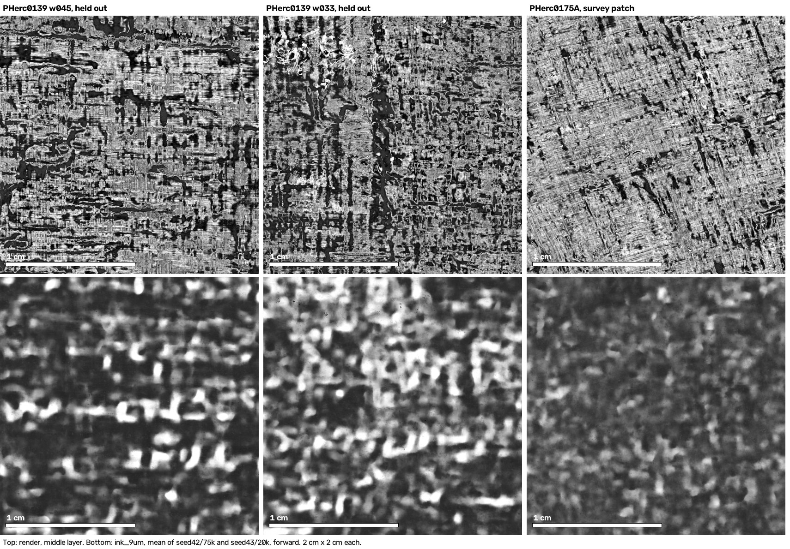
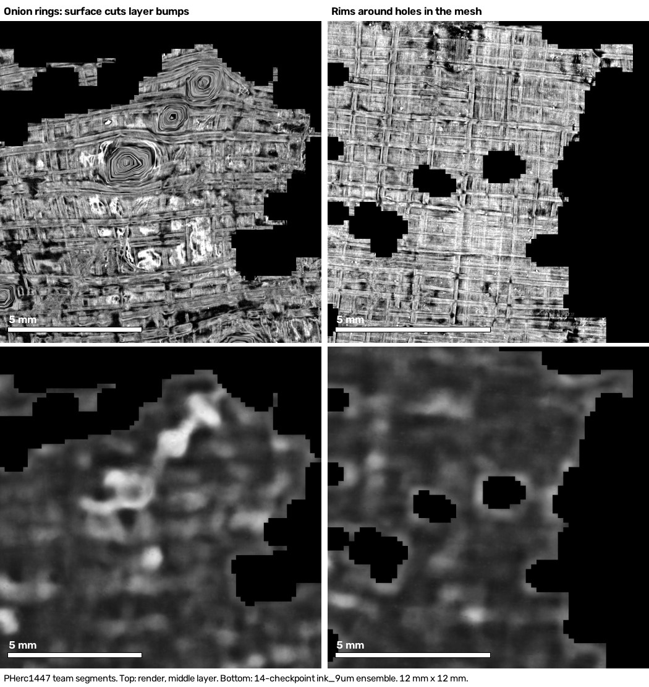
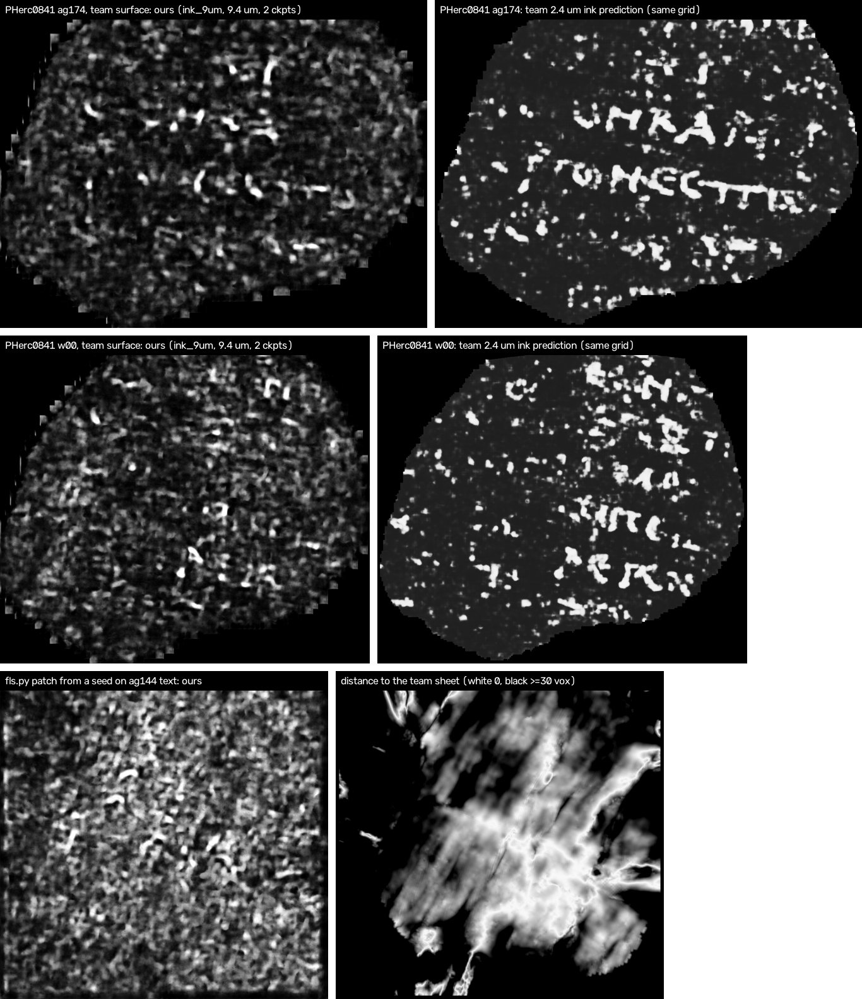

# First Letters survey

An automated first pass, with the released 9 µm ink models, over the scroll volumes eligible for the
[First Letters prizes](https://scrollprize.org/prizes#first-letters-prizes). For each scroll a patch is grown on
the m7 surface prediction with the tracer and parameters that VC3D's *Create Segment (GrowPatch)* uses, rendered
at native resolution, run through [`scrollprize/ink_9um`](https://huggingface.co/scrollprize/ink_9um) in both
depth directions, and checked by eye. Everything streams from the open-data bucket. The whole survey ran on one
machine: an RTX 3060 (12 GB), a 14-core Xeon and a home Wi-Fi link.

> Status: <!-- STATUS -->65 patches (971 cm²) on 21 of the 21 eligible scrolls without catalog segments, and 20 of the team's published segments, as of 2026-09-24 15:07Z. The survey is complete.<!-- /STATUS -->

## Summary

<!-- SUMMARY -->
- **No letter-like ink in any patch.** On 65 automatically grown patches (971 cm² in total) the two checkpoints give speckle in both depth directions: no rows and no letter shapes (row scores 8.0–33.5).
- **All 14 released checkpoints, averaged, in both directions** on 10 patches whose renders show the sheet over large areas: still no letters (row scores 5.6–16.9; every map checked by eye).
- **The team's own segments** of PHerc0800 and PHerc1447 (20 of 21; 1 held back from this release for further checks), run through all 14 released checkpoints and averaged, show the same: blobs, bright rims around holes in the mesh and responses on onion-ring artifacts (see *Validation*), no rows (row scores 2.5–23.1).
- **These negatives do not mean there is no text.** We ran the same pipeline on PHerc0841, a scroll the models never saw, where the team's 2.4 µm predictions show Greek text (see *Calibration on a scroll the models never saw*). On the team's own traced surfaces the maps find where the ink is, but only as blobs: no letter is readable and rows show on one of three segments. And patches grown by `fls.py` from seeds placed on that text leave the text-bearing sheet (0 of 3 stay on it) and look like the speckle here. Held-out segments of PHerc0139, a scroll the models were trained on, do give clear rows (row scores 73–148).
- **Most automatic patches do not follow a single sheet** for long near the compressed core: their renders show layer-crossing swirls. Hand refinement in VC3D, as the team's workflow recommends, is the obvious next step for any region worth a closer look.
<!-- /SUMMARY -->

## Quick start

`fls.py` goes from an eligible scroll to ink maps on a freshly grown patch in one command.

```bash
# Needs: vc_grow_seg_from_seed and vc_render_tifxyz built from current villa main, the `vesuvius` Python package
# (villa/vesuvius) with zarr, s3fs, opencv-python and tifffile, and a CUDA GPU.
export VC_BIN=~/villa/build/bin FLS_WORK=~/fls_work
python fls.py seeds --scroll PHerc1218            # candidate seeds, all inside the scan mask
python fls.py run --scroll PHerc1218              # seed -> grids -> grow -> render -> ink maps -> report
python fls.py run --scroll PHerc1218 --seed 2514 4434 11616 --gens 60 --name my_patch   # X Y Z
```

Each run writes to `$FLS_WORK/patches/<scroll>/<name>/`: the grown surface (tifxyz), the 28-layer surface volume
(zarr), four ink maps (two checkpoints × two directions) plus the mean of the checkpoints for each direction, as TIFF
and PNG, the render's middle layer as PNG, and `scores.json`. Averaging helps: on held-out PHerc0139 w045 the two
default checkpoints score 84 and 111 alone and 125 averaged. `--ckpts all` runs all 14 released checkpoints (148 on
w045), at seven times the inference cost. Steps whose output exists are skipped, so an interrupted run resumes. Checkpoints are downloaded from
Hugging Face on first use. `FLS_NO_CUDNN=1` disables cuDNN for inference; that was needed here because of a cuDNN
sub-library mismatch in the local PyTorch install.

Build the tools from current villa main: the published container image `ghcr.io/scrollprize/villa/volume-cartographer:main`
is built from 2026-05-13 source (1e3f4c021), whose `vc_render_tifxyz` has no `--flip-normals`, which `fls.py`
passes ([villa #1588](https://github.com/ScrollPrize/villa/issues/1588), where bnleft hit exactly this).

The tracer and the renderer cache the chunks they stream (surface prediction and scan) in VC3D's remote cache,
`~/.VC3D/remote_cache` by default, and this adds up to gigabytes. To put it on a bigger disk, point
`VC3D_CONFIG_DIR` at a directory whose `VC3D.ini` contains `[viewer]` and `remote_cache_dir=/big/disk/remote_cache`.
A render that dies on a dropped connection is retried up to three times.

A 20-generation test patch with the default seed (PHerc0343, 0.42 cm²) took 3 min 46 s end to end: 68 s to fetch
2,757 normal-grid slices, 61 s to grow, 26 s to render and 4 × 17–18 s of inference. Patches need to be over about
1 cm across for the row score; 100 generations give 12–17 cm².

## Repository layout

- `fls.py`: the survey tool (the only file needed to run a patch).
- `results/results.json`: every patch and published segment with its seed, area, visual verdict and row scores, plus
  the per-volume census of the prediction outside the scan mask.
- `results/sheets/`: one contact sheet per item (render middle layer and ink maps).
- `results/segments/`: the grown patches in tifxyz, volume-cartographer's surface format, for re-rendering with
  `vc_render_tifxyz` or as a starting point for refinement.
- `analysis/`: `rowscore.py` and `tile_scores.py` (the triage score), `census_outside_mask.py` (the census),
  `slab_profile.py` and `recenter.py` (the slab-centring check and the re-centring test).
- `analysis/unseen_scroll_pherc0841/`: the calibration on PHerc0841 (plan, results, notes by eye, scripts, logs).

## Method

1. **Seeds.** At heights 0.3, 0.5 and 0.7 of the scan, radii 0.5 and 0.7 of the masked scan's radius and three
   angles, take the nearest voxel of the m7 surface prediction that lies inside the scan mask. The mask matters,
   because the prediction also lights up outside the papyrus (see *Found along the way*).
2. **Normal grids.** The tracer reads one normal-grid slice per plane and position, and fetches them one by one when
   they are missing. `fls.py` first fetches, in parallel over keep-alive connections, only the slices a patch of the
   requested size can reach (±1.15 × generations × step voxels around the seed). The tracer streams anything else.
3. **Grow.** `vc_grow_seg_from_seed` in seed mode with step size 20, 100 generations, the normal grids and the
   volume's voxel size: the GrowPatch parameters, with `thread_limit` 8 and `OPENBLAS_NUM_THREADS=1`.
4. **Render.** `vc_render_tifxyz --scale 1 --num-slices 28 --flip-normals`: the scrollprize.org 9 µm recipe.
5. **Ink.** `vesuvius.ink_detection.inference.infer` with overlap 0.5 and Hann blending, checkpoints
   `hybrid_3d2d-seed42/step-075000` and `hybrid_3d2d-seed43/step-020000`, both depth directions (a traced
   surface's orientation is arbitrary). For the team's own segments: all 14 released checkpoints, forward, averaged.
6. **Triage score.** Text sits in rows a few millimetres apart, so an ink map that shows text has a spectral peak at
   a 2.5–8 mm period. The score is the peak power in that band over the band's median, computed on the largest
   connected piece of the rendered surface. It is only a triage aid (see *Validation*).
7. **Verdict.** Every ink map was looked at next to its render. The verdicts, including whether the surface follows
   a sheet or cuts across layers, are in `results/results.json`.

## Validation

- **Render.** Our render of PHerc0139 segment w035, from its published 9.362 µm tifxyz, matches the published
  surface volume: 99.68 % of voxels identical, the rest off by one grey level, same depth orientation.
- **Inference, positive controls.** The same code on PHerc0139 segments with known text:

  | segment | in the models' training set? | checkpoints | row score | period | rows |
  |---|---|---|---|---|---|
  | w035 (full) | yes | seed42/75k | 89.8 | 4.75 mm | horizontal |
  | w035 (2048² crop) | yes | 14, averaged | 101.9 | 4.79 mm | horizontal |
  | w045 | no | 14, averaged | 147.7 | 4.89 mm | horizontal |
  | w033 | no | 14, averaged | 73.3 | 4.94 mm | horizontal |

  w045 and w033 are not in the ink_9um training list, but their scroll is: held-out segments of a training scroll can
  overstate sensitivity (rodriguescarson found one such control sitting between training windings), so see also
  *Calibration on a scroll the models never saw* below. The team's higher-resolution ink maps of w045 and w033 show
  rows of Greek text, and so do ours:

  
- **Slab centring.** bnleft's check from [First Light, PHerc. 0211](https://github.com/bnleft/first-light-pherc0211)
  counts the 256 px tiles whose brightness peak lies in the middle third of the rendered slab. The held-out and
  training controls score 55–87 %; our patches that follow their sheet score 27–46 % (median 34 %), and patches that
  cross layers 21–34 %. To test whether this hides ink, we re-rendered 48 layers and moved each 64 px tile's
  brightness peak to layer 12 (the controls' median). That lifts our best on-sheet patch (PHerc0175A, v3 seed 7) from
  40 % to 70 %, and its ink maps stay speckle. But the same step weakens real text on both held-out controls: the
  forward row score of the two-checkpoint mean falls from 71.4 to 44.7 on w033 and from 125.1 to 104.9 on w045
  (rows still found). The ink sits on the sheet's surface, not at its brightness peak, so re-centring on brightness
  is not a fix, and fewer detections after it are expected even where there is ink. Our patches' lower centring
  share may still mean their surfaces wander off the papyrus face; we have not measured that directly.
- **Two artifacts to recognize.** On the team's PHerc1447 segments the models light up where the surface cuts through
  bumps in the layers (the concentric "onion rings" in the render) and along the rims of holes in the mesh. Both can
  look like curved strokes; the render shows where they come from:

  
- **Limits of the score.** Cut into 6 cm² tiles, the same control maps score 6.8–77.4, which overlaps the range of
  the negatives, so a low score on a small patch proves little. That is why every verdict here is visual. The
  other way round, the highest single map in the survey (33.5, PHerc0813 v3 seed 0, reverse) is speckle and blotches
  on a patch that cuts across layers throughout; all four of its maps peak at the same 6.61 mm period and angle, in
  both directions (7.8–33.5), and by eye no rows show. The next (28.7, PHerc0191) comes from broad bands in a patch that
  also cuts across layers; the other three maps of that patch score 7.2–9.2.

## Calibration on a scroll the models never saw

PHerc0841 is not in the `ink_9um` training set and not First Letters eligible, and the team's 2.4 µm ink predictions
show Greek text on three of its traced segments. We ran this pipeline on its 9.366 µm scan (1.2 m, 113 keV, like the
eligible 9.362 µm volumes), with the arms, readouts and pass/fail rules written down before any inference
([details, data and scripts](analysis/unseen_scroll_pherc0841/)):

- **On the team's own surfaces**, rendered exactly as here (our render matches their surface volume at r 0.999998),
  `ink_9um` finds where the ink is: r 0.54–0.61 against the team's predictions (shifted-map nulls at most 0.13), pixel
  AUC 0.74–0.81 against their labels. At letter scale it is blobs: Chris Scheirer's high-pass score is 0.046–0.054 with
  all 14 checkpoints averaged (on his scale, blobs score 0.04 and a read where a person made out four letters 0.076).
  No letter is readable. Rows show on one segment (ag174, row score 57.8); on the other two even the team's own
  prediction scores only 34.1 and 28.7.
- **With the whole tool**, from seeds placed on the team's text, the grown surface leaves the text-bearing sheet: 0 of 3
  patches stay within 5 voxels of it (median distance 20–28 voxels), and their ink maps look like the speckle in the
  table below. Where the w00 and ag144 patches do lie on the sheet, their maps agree with the team's there (r 0.61 and
  0.56); the ag174 patch meets it only along crossing lines (r 0.10).
- **So** a negative in this survey means that the automatic patch showed no text, not that the spot has none. Under
  the pre-registered rules the clean-surface arm is inconclusive (1 of 3 segments passes, 2 were needed) and the
  whole-tool arm scores 0 of 3. The row-score threshold was not checked against the reference before the plan was
  frozen; the details page says what that changes.



## Results

<!-- RESULTS -->
| scroll | pass / seed | area (cm²) | surface (from the render) | ink maps | best row score | sheet |
|---|---|---|---|---|---|---|
| PHerc0125 | v2 z 0.4, r 0.35 | 14.2 | partly on the sheet, crease across | speckle in both directions; no rows, no letter-like shapes | 11.3 | [view](results/sheets/v2_PHerc0125_s0.jpg) |
| PHerc0125 | v3 z 0.3, r 0.5 | 13.7 | follows the sheet throughout (crosshatch, cracks) | speckle in both directions; no rows, no letter-like shapes | 8.0 | [view](results/sheets/v3_PHerc0125_s0.jpg) |
| PHerc0125 | v3 z 0.5, r 0.7 | 14.6 | escapes the papyrus into uniform material in places | speckle in both directions; no rows, no letter-like shapes | 14.5 | [view](results/sheets/v3_PHerc0125_s7.jpg) |
| PHerc0175A | v1 z 0.4, r 0.6 | 12.2 | on the sheet in the centre (diagonal fiber crosshatch), swirls at edges | speckle in both directions; no rows, no letter-like shapes | 13.4 | [view](results/sheets/v1_PHerc0175A_s1.jpg) |
| PHerc0175A | v2 z 0.4, r 0.35 | 13.4 | partly on the sheet, layer-crossing swirls | speckle in both directions; no rows, no letter-like shapes | 10.7 | [view](results/sheets/v2_PHerc0175A_s0.jpg) |
| PHerc0175A | v3 z 0.3, r 0.5 | 11.7 | follows the sheet over most of the patch (crosshatch), diagonal cracks | speckle in both directions; no rows, no letter-like shapes | 22.1 | [view](results/sheets/v3_PHerc0175A_s0.jpg) |
| PHerc0175A | v3 z 0.5, r 0.7 | 11.7 | follows the sheet throughout (crosshatch) | speckle in both directions; no rows, no letter-like shapes | 13.0 | [view](results/sheets/v3_PHerc0175A_s7.jpg) |
| PHerc0175B | v1 z 0.4, r 0.6 | 14.1 | on-sheet band across the middle, swirls elsewhere | speckle; one ~1 mm ring in both directions (not direction-specific); no rows, no letter-like shapes | 10.7 | [view](results/sheets/v1_PHerc0175B_s1.jpg) |
| PHerc0175B | v2 z 0.4, r 0.35 | 15.4 | layer-crossing swirls | speckle in both directions; no rows, no letter-like shapes | 15.4 | [view](results/sheets/v2_PHerc0175B_s0.jpg) |
| PHerc0175B | v3 z 0.3, r 0.5 | 14.7 | radial layer-crossing swirls | speckle in both directions; no rows, no letter-like shapes | 8.9 | [view](results/sheets/v3_PHerc0175B_s0.jpg) |
| PHerc0175B | v3 z 0.5, r 0.7 | 15.2 | layer-crossing swirls, small on-sheet areas | speckle in both directions; no rows, no letter-like shapes | 10.5 | [view](results/sheets/v3_PHerc0175B_s9.jpg) |
| PHerc0191 | v2 z 0.4, r 0.35 | 16.2 | swirls, small on-sheet core | speckle in both directions; no rows, no letter-like shapes | 11.1 | [view](results/sheets/v2_PHerc0191_s0.jpg) |
| PHerc0191 | v3 z 0.3, r 0.5 | 16.9 | swirls around folds, on-sheet crosshatch in the lower corners | speckle in both directions; no rows, no letter-like shapes | 10.4 | [view](results/sheets/v3_PHerc0191_s0.jpg) |
| PHerc0191 | v3 z 0.5, r 0.7 | 17.5 | radial swirls and gaps (layer-crossing) | speckle in both directions; no rows, no letter-like shapes | 28.7 | [view](results/sheets/v3_PHerc0191_s9.jpg) |
| PHerc0211 | v2 z 0.4, r 0.35 | 14.3 | on-sheet core, swirls at edges | speckle in both directions; no rows, no letter-like shapes | 10.1 | [view](results/sheets/v2_PHerc0211_s0.jpg) |
| PHerc0211 | v3 z 0.3, r 0.5 | 14.7 | follows the sheet throughout (diagonal crosshatch) | speckle in both directions; no rows, no letter-like shapes | 11.7 | [view](results/sheets/v3_PHerc0211_s0.jpg) |
| PHerc0211 | v3 z 0.5, r 0.7 | 13.9 | escapes the papyrus into uniform material over most of the patch | uniform speckle (the models fire on the non-papyrus material too); no rows, no letter-like shapes | 19.4 | [view](results/sheets/v3_PHerc0211_s9.jpg) |
| PHerc0257 | v2 z 0.4, r 0.35 | 16.9 | radial swirls (compressed region) | speckle in both directions; no rows, no letter-like shapes | 10.1 | [view](results/sheets/v2_PHerc0257_s0.jpg) |
| PHerc0257 | v3 z 0.3, r 0.5 | 16.2 | radial layer-crossing swirls with some faint crosshatch | speckle in both directions; no rows, no letter-like shapes | 10.9 | [view](results/sheets/v3_PHerc0257_s0.jpg) |
| PHerc0257 | v3 z 0.5, r 0.7 | 16.0 | escapes the papyrus into uniform material and air over most of the patch | uniform speckle on the non-papyrus material; no rows, no letter-like shapes | 12.6 | [view](results/sheets/v3_PHerc0257_s9.jpg) |
| PHerc0268 | v2 z 0.4, r 0.35 | 14.6 | swirls and gaps | speckle in both directions; no rows, no letter-like shapes | 12.4 | [view](results/sheets/v2_PHerc0268_s0.jpg) |
| PHerc0268 | v3 z 0.3, r 0.5 | 15.0 | radial layer-crossing swirls (compressed region) | speckle in both directions; no rows, no letter-like shapes | 11.4 | [view](results/sheets/v3_PHerc0268_s0.jpg) |
| PHerc0268 | v3 z 0.5, r 0.7 | 15.7 | radial layer-crossing swirls (compressed region) | speckle in both directions; no rows, no letter-like shapes | 13.6 | [view](results/sheets/v3_PHerc0268_s9.jpg) |
| PHerc0306B | v2 z 0.4, r 0.35 | 14.6 | radial swirls | speckle in both directions; no rows, no letter-like shapes | 9.2 | [view](results/sheets/v2_PHerc0306B_s0.jpg) |
| PHerc0306B | v3 z 0.3, r 0.5 | 14.6 | radial layer-crossing swirls, small on-sheet areas | speckle in both directions; no rows, no letter-like shapes | 12.7 | [view](results/sheets/v3_PHerc0306B_s0.jpg) |
| PHerc0306B | v3 z 0.5, r 0.7 | 11.9 | follows the sheet throughout (crosshatch, cracks) | speckle in both directions; no rows, no letter-like shapes | 9.8 | [view](results/sheets/v3_PHerc0306B_s9.jpg) |
| PHerc0343 | v2 z 0.4, r 0.35 | 14.7 | partly on the sheet, swirls | speckle in both directions; no rows, no letter-like shapes | 12.0 | [view](results/sheets/v2_PHerc0343_s0.jpg) |
| PHerc0343 | v3 z 0.3, r 0.5 | 14.0 | swirls through the middle, on-sheet crosshatch in the corners | speckle in both directions; no rows, no letter-like shapes | 12.7 | [view](results/sheets/v3_PHerc0343_s0.jpg) |
| PHerc0343 | v3 z 0.5, r 0.7 | 12.6 | follows the sheet over most of the patch (crosshatch); one corner reaches air and uniform material | speckle in both directions; no rows, no letter-like shapes | 11.5 | [view](results/sheets/v3_PHerc0343_s9.jpg) |
| PHerc0358 | v2 z 0.4, r 0.35 | 15.7 | partly on the sheet, swirls | speckle in both directions; no rows, no letter-like shapes | 15.0 | [view](results/sheets/v2_PHerc0358_s0.jpg) |
| PHerc0358 | v3 z 0.3, r 0.5 | 16.0 | on-sheet crosshatch in places, swirls and a dark fold | speckle in both directions; no rows, no letter-like shapes | 10.7 | [view](results/sheets/v3_PHerc0358_s0.jpg) |
| PHerc0358 | v3 z 0.5, r 0.7 | 17.1 | radial layer-crossing swirls | speckle in both directions; no rows, no letter-like shapes | 11.5 | [view](results/sheets/v3_PHerc0358_s7.jpg) |
| PHerc0483A | v2 z 0.4, r 0.35 | 13.1 | partly on the sheet, swirls | speckle in both directions; no rows, no letter-like shapes | 15.4 | [view](results/sheets/v2_PHerc0483A_s0.jpg) |
| PHerc0483A | v3 z 0.3, r 0.5 | 12.8 | follows the sheet over most of the patch (crosshatch), swirls in one corner | speckle in both directions; no rows, no letter-like shapes | 12.8 | [view](results/sheets/v3_PHerc0483A_s0.jpg) |
| PHerc0483A | v3 z 0.5, r 0.7 | 13.0 | on the sheet over most of the patch (diagonal crosshatch), swirls in one corner | speckle in both directions; no rows, no letter-like shapes | 9.7 | [view](results/sheets/v3_PHerc0483A_s8.jpg) |
| PHerc0483B | v2 z 0.4, r 0.35 | 14.3 | radial swirls (layer-crossing near the core) | speckle in both directions; no rows, no letter-like shapes | 12.3 | [view](results/sheets/v2_PHerc0483B_s0.jpg) |
| PHerc0483B | v3 z 0.3, r 0.5 | 13.1 | on the sheet in the upper half (crosshatch), swirls below, a mesh hole in one corner | speckle in both directions; no rows, no letter-like shapes | 10.6 | [view](results/sheets/v3_PHerc0483B_s0.jpg) |
| PHerc0483B | v3 z 0.5, r 0.7 | 14.7 | radial layer-crossing swirls | speckle in both directions; no rows, no letter-like shapes | 11.4 | [view](results/sheets/v3_PHerc0483B_s8.jpg) |
| PHerc0490A | v2 z 0.4, r 0.35 | 14.6 | radial swirls | speckle in both directions; no rows, no letter-like shapes | 8.8 | [view](results/sheets/v2_PHerc0490A_s0.jpg) |
| PHerc0490A | v3 z 0.3, r 0.5 | 15.0 | radial layer-crossing swirls with mesh holes | speckle in both directions; no rows, no letter-like shapes | 14.4 | [view](results/sheets/v3_PHerc0490A_s0.jpg) |
| PHerc0490A | v3 z 0.5, r 0.7 | 14.2 | swirls and mesh holes, on-sheet crosshatch in the centre | speckle in both directions; no rows, no letter-like shapes | 13.6 | [view](results/sheets/v3_PHerc0490A_s9.jpg) |
| PHerc0490B | v2 z 0.4, r 0.35 | 15.0 | swirls and dark gaps | speckle in both directions; no rows, no letter-like shapes | 11.6 | [view](results/sheets/v2_PHerc0490B_s0.jpg) |
| PHerc0490B | v3 z 0.3, r 0.5 | 14.0 | crosshatch on the upper left, radial layer-crossing swirls elsewhere, mesh holes on the right | speckle in both directions; no rows, no letter-like shapes | 11.4 | [view](results/sheets/v3_PHerc0490B_s0.jpg) |
| PHerc0490B | v3 z 0.5, r 0.7 | 14.6 | on-sheet crosshatch in the upper half, swirls and folds below | speckle in both directions; no rows, no letter-like shapes | 11.8 | [view](results/sheets/v3_PHerc0490B_s9.jpg) |
| PHerc0813 | v2 z 0.4, r 0.35 | 16.2 | on-sheet band across the middle, swirls around it | speckle in both directions; no rows, no letter-like shapes | 11.8 | [view](results/sheets/v2_PHerc0813_s0.jpg) |
| PHerc0813 | v3 z 0.3, r 0.5 | 17.3 | radial layer-crossing swirls throughout | speckle in both directions; no rows, no letter-like shapes | 33.5 | [view](results/sheets/v3_PHerc0813_s0.jpg) |
| PHerc0813 | v3 z 0.5, r 0.7 | 13.8 | follows the sheet throughout (diagonal crosshatch) | speckle in both directions; no rows, no letter-like shapes | 13.2 | [view](results/sheets/v3_PHerc0813_s9.jpg) |
| PHerc0826 | v2 z 0.4, r 0.35 | 17.1 | swirls and gaps | speckle in both directions; no rows, no letter-like shapes | 22.5 | [view](results/sheets/v2_PHerc0826_s0.jpg) |
| PHerc0826 | v3 z 0.3, r 0.5 | 17.1 | radial layer-crossing swirls throughout | speckle in both directions; no rows, no letter-like shapes | 12.4 | [view](results/sheets/v3_PHerc0826_s0.jpg) |
| PHerc0826 | v3 z 0.5, r 0.7 | 15.0 | follows the sheet on the right two-thirds (crosshatch), swirls on the left | speckle in both directions; no rows, no letter-like shapes | 11.3 | [view](results/sheets/v3_PHerc0826_s9.jpg) |
| PHerc0846A | v2 z 0.4, r 0.35 | 15.3 | on the sheet in the centre (crosshatch), swirls around it | speckle in both directions; no rows, no letter-like shapes | 9.5 | [view](results/sheets/v2_PHerc0846A_s0.jpg) |
| PHerc0846A | v3 z 0.3, r 0.5 | 15.7 | follows the sheet on the right half (crosshatch), swirls on the left | speckle in both directions; no rows, no letter-like shapes | 13.5 | [view](results/sheets/v3_PHerc0846A_s0.jpg) |
| PHerc0846A | v3 z 0.5, r 0.7 | 17.6 | radial layer-crossing swirls, some crosshatch near the centre | speckle in both directions; no rows, no letter-like shapes | 16.9 | [view](results/sheets/v3_PHerc0846A_s9.jpg) |
| PHerc0846B | v2 z 0.4, r 0.35 | 16.0 | arcs along the layers with swirls around a compressed centre | speckle in both directions; no rows, no letter-like shapes | 20.2 | [view](results/sheets/v2_PHerc0846B_s0.jpg) |
| PHerc0846B | v3 z 0.3, r 0.5 | 15.1 | follows the sheet over most of the patch (diagonal crosshatch, cracks), swirls at the edges | speckle in both directions; no rows, no letter-like shapes | 11.8 | [view](results/sheets/v3_PHerc0846B_s0.jpg) |
| PHerc0846B | v3 z 0.5, r 0.7 | 16.8 | sheet with crosshatch and mesh holes on the upper left, swirls below | speckle in both directions with a brighter diagonal band along the holed region, the same in both directions (structural); no rows, no letter-like shapes | 17.2 | [view](results/sheets/v3_PHerc0846B_s4.jpg) |
| PHerc1203 | v2 z 0.4, r 0.35 | 16.1 | on the sheet in one corner (crosshatch), swirls elsewhere | speckle in both directions; no rows, no letter-like shapes | 12.1 | [view](results/sheets/v2_PHerc1203_s0.jpg) |
| PHerc1203 | v3 z 0.3, r 0.5 | 16.9 | radial layer-crossing swirls throughout | speckle in both directions; no rows, no letter-like shapes | 11.0 | [view](results/sheets/v3_PHerc1203_s0.jpg) |
| PHerc1203 | v3 z 0.5, r 0.7 | 17.3 | swirls on the left; escapes into a void and uniform material at the centre and lower right; mesh holes | speckle; the uniform material lights up in both directions (the models fire on non-papyrus material); no rows, no letter-like shapes | 25.6 | [view](results/sheets/v3_PHerc1203_s9.jpg) |
| PHerc1218 | v2 z 0.4, r 0.35 | 13.3 | on-sheet half, swirls | speckle in both directions; no rows, no letter-like shapes | 13.1 | [view](results/sheets/v2_PHerc1218_s0.jpg) |
| PHerc1218 | v3 z 0.3, r 0.5 | 13.3 | follows the sheet on the left half (crosshatch), swirls on the right | speckle in both directions; no rows, no letter-like shapes | 11.3 | [view](results/sheets/v3_PHerc1218_s0.jpg) |
| PHerc1218 | v3 z 0.5, r 0.7 | 12.8 | follows the sheet over most of the patch (crosshatch), a diagonal crease through the centre, swirls lower middle | speckle in both directions; no rows, no letter-like shapes | 14.5 | [view](results/sheets/v3_PHerc1218_s7.jpg) |
| PHerc1545 | v2 z 0.4, r 0.35 | 17.4 | layer-crossing swirls and gaps | speckle in both directions; no rows, no letter-like shapes | 15.5 | [view](results/sheets/v2_PHerc1545_s0.jpg) |
| PHerc1545 | v3 z 0.3, r 0.5 | 16.7 | radial layer-crossing swirls throughout | speckle in both directions; no rows, no letter-like shapes | 12.1 | [view](results/sheets/v3_PHerc1545_s0.jpg) |
| PHerc1545 | v3 z 0.5, r 0.7 | 15.5 | follows the sheet on the left half (crosshatch); escapes into a void and uniform material on the upper right (mesh holes) | speckle in both directions; no rows, no letter-like shapes | 14.8 | [view](results/sheets/v3_PHerc1545_s9.jpg) |

**Published segments (14-checkpoint ensemble, forward):**

| scroll | segment | surface | ink map | row score | sheet |
|---|---|---|---|---|---|
| PHerc0800 | 20251028213516-auto_grown_20251028213516907 | follows the sheet (fiber crosshatch visible) | scattered blobs and border edges; no rows, no letter-like shapes | 23.1 | [view](results/sheets/published_PHerc0800_20251028213516-auto_grown_20251028213516.jpg) |
| PHerc0800 | 20251028220042-auto_grown_20251028220042762 | follows the sheet (fiber crosshatch visible) | scattered blobs and border edges; no rows, no letter-like shapes | 6.2 | [view](results/sheets/published_PHerc0800_20251028220042-auto_grown_20251028220042.jpg) |
| PHerc0800 | 20251028220955-auto_grown_20251028220955262 | follows the sheet (fiber crosshatch visible) | scattered blobs and border edges; no rows, no letter-like shapes | 12.4 | [view](results/sheets/published_PHerc0800_20251028220955-auto_grown_20251028220955.jpg) |
| PHerc0800 | 20251028222030-auto_grown_20251028222030940 | follows the sheet (fiber crosshatch visible) | scattered blobs and border edges; no rows, no letter-like shapes | 5.8 | [view](results/sheets/published_PHerc0800_20251028222030-auto_grown_20251028222030.jpg) |
| PHerc0800 | 20251028225813-auto_grown_20251028225813045 | follows the sheet (fiber crosshatch visible) | scattered blobs and border edges; no rows, no letter-like shapes | 5.4 | [view](results/sheets/published_PHerc0800_20251028225813-auto_grown_20251028225813.jpg) |
| PHerc0800 | 20251029010146-auto_grown_20251029010146642 | follows the sheet (fiber crosshatch visible) | scattered blobs and border edges; no rows, no letter-like shapes | 2.5 | [view](results/sheets/published_PHerc0800_20251029010146-auto_grown_20251029010146.jpg) |
| PHerc1447 | 20250502180708-auto_grown_20250502160708188 | oblique striations: surface cuts across several layers | border artifacts and blobs; no letter-like shapes |  | [view](results/sheets/published_PHerc1447_20250502180708-auto_grown_20250502160708.jpg) |
| PHerc1447 | 20250502180748-auto_grown_20250502160748721 | oblique striations: surface cuts across several layers | border artifacts and blobs; no letter-like shapes | 3.0 | [view](results/sheets/published_PHerc1447_20250502180748-auto_grown_20250502160748.jpg) |
| PHerc1447 | 20250502182142-auto_grown_20250502161324419 | oblique striations: surface cuts across several layers | border artifacts and blobs; no letter-like shapes | 7.4 | [view](results/sheets/published_PHerc1447_20250502182142-auto_grown_20250502161324.jpg) |
| PHerc1447 | 20250502182456-auto_grown_20250502161202782 | oblique striations: surface cuts across several layers | border artifacts and blobs; no letter-like shapes | 3.8 | [view](results/sheets/published_PHerc1447_20250502182456-auto_grown_20250502161202.jpg) |
| PHerc1447 | 20250502183138-auto_grown_20250502162038685 | oblique striations: surface cuts across several layers | border artifacts and blobs; no letter-like shapes |  | [view](results/sheets/published_PHerc1447_20250502183138-auto_grown_20250502162038.jpg) |
| PHerc1447 | 20250502183421-auto_grown_20250502161744358 | oblique striations: surface cuts across several layers | border artifacts and blobs; no letter-like shapes | 8.4 | [view](results/sheets/published_PHerc1447_20250502183421-auto_grown_20250502161744.jpg) |
| PHerc1447 | 20250502184201-auto_grown_20250502163549332 | oblique striations: surface cuts across several layers | border artifacts and blobs; no letter-like shapes | 3.8 | [view](results/sheets/published_PHerc1447_20250502184201-auto_grown_20250502163549.jpg) |
| PHerc1447 | 20250502184658-auto_grown_20250502163923577 | oblique striations: surface cuts across several layers | border artifacts and blobs; no letter-like shapes | 9.6 | [view](results/sheets/published_PHerc1447_20250502184658-auto_grown_20250502163923.jpg) |
| PHerc1447 | 20250502184845-auto_grown_20250502164121265 | oblique striations: surface cuts across several layers | border artifacts and blobs; no letter-like shapes | 5.7 | [view](results/sheets/published_PHerc1447_20250502184845-auto_grown_20250502164121.jpg) |
| PHerc1447 | 20250502185519-auto_grown_20250502164303733 | oblique striations: surface cuts across several layers | border artifacts and blobs; no letter-like shapes | 4.8 | [view](results/sheets/published_PHerc1447_20250502185519-auto_grown_20250502164303.jpg) |
| PHerc1447 | 20250502205333-auto_grown_20250502181030065 | oblique striations: surface cuts across several layers | border artifacts and blobs; no letter-like shapes | 14.2 | [view](results/sheets/published_PHerc1447_20250502205333-auto_grown_20250502181030.jpg) |
| PHerc1447 | 20250703025628-auto_grown_20250703025628283 | follows the sheet | bright rings around mask holes (border artifact), blobs; no letter-like shapes | 8.8 | [view](results/sheets/published_PHerc1447_20250703025628-auto_grown_20250703025628.jpg) |
| PHerc1447 | 20250703034159-auto_grown_20250703034159599 | follows the sheet | blobs, hole-border arcs; no letter-like shapes | 11.7 | [view](results/sheets/published_PHerc1447_20250703034159-auto_grown_20250703034159.jpg) |
| PHerc1447 | 20251105093211-z_dbg_gen_00320 | on the sheet between many onion-ring spots, where the surface cuts through bumps in the layers | blobs; bright curves and rings exactly on the onion rings (artifact); no rows, no letter-like shapes | 6.3 | [view](results/sheets/published_PHerc1447_20251105093211-z_dbg_gen_00320.jpg) |
<!-- /RESULTS -->

## Costs (measured)

- **Normal grids:** about 13,800 slices (~5 GB) for a 100-generation patch. A fresh fetch took 5.5–24 min (median
  9 min) over home Wi-Fi.
- **Grow:** 11.7–17.1 cm² per 100-generation patch in 39–71 min, with 8 threads and 2–4 tracers running side by
  side.
- **Render:** 124–308 s per patch.
- **Inference:** 80–100 s per checkpoint and direction on ~15 cm² (RTX 3060).

## Found along the way

- **The m7 surface prediction lights up outside the papyrus.** This is known: spencerdavis-tx reported it in July for
  Scroll 3 and warned that tracer seeds placed naively ride these phantom shells
  ([villa #1114](https://github.com/ScrollPrize/villa/issues/1114)), and axiosdevs measured it on all 36 samples
  (43.3 % of positives outside the masked CT,
  [Herculaneum Scroll Tools](https://github.com/axiosdevs/herculaneum-scroll-tools)). We missed both and hit exactly
  that failure: our first seed picker used the prediction's extent as the scroll's radius, and 60 of its 137 seeds
  landed outside the scroll (6 more straddled the edge). Those patches are excluded here, and the seed picker now works
  from the scan mask. Our per-volume check on the 23 First Letters volumes (level 5, `results/results.json`) agrees:
  34.0–60.7 % of lit samples (median 47.8 %) lie where the masked scan is 0.
- **`vc_render_tifxyz` aborts on a network drop** (`terminate called recursively`, core dump) instead of retrying.
  Two survey renders died that way during Wi-Fi drops. Reported as
  [villa #1809](https://github.com/ScrollPrize/villa/issues/1809); since
  [villa #1817](https://github.com/ScrollPrize/villa/pull/1817) (merged 2026-09-24) it exits with an error message and
  code 1 instead, and `fls.py` retries the render.
- **The tracer's OpenBLAS pool spins on every core.** A 40-generation GrowPatch on a remote volume used 1,705
  CPU-seconds with the pool left alone and 226 with it capped, for the same surface. Fix proposed in
  [villa #1795](https://github.com/ScrollPrize/villa/pull/1795). This survey caps it with `OPENBLAS_NUM_THREADS=1`.

## Related work

- [From CT Scan to Ancient Text: A First Letters Prize Workflow](https://scrollprize.substack.com/p/from-ct-scan-to-ancient-text-a-first)
  is the team's guide to the same steps done by hand in VC3D. Lutfiya Miller and Chris Müller ran it end to end on
  PHerc0826 and published their images, commands and costs.
- [vesuvius-automesh](https://github.com/spencerdavis-tx/vesuvius-automesh) (spencerdavis-tx) harvests surface
  automatically on Scroll 3: it masks the predictions against the CT, sweeps tracer seeds and accepts output through a
  quality gate. That is a far more careful meshing pipeline than the single grown patch per seed used here.
- [First Light, PHerc. 0211](https://github.com/bnleft/first-light-pherc0211) (bnleft) runs the team's spiral-fit
  workflow end to end on PHerc0211 with a preregistered readout, sees no ink, and adds a slab-centring check
  (is the papyrus brightness peak in the middle of the rendered slab?) that we then ran on our patches too
  (see *Limitations*).
- [villa #1872](https://github.com/ScrollPrize/villa/pull/1872) (Danishk2445) proposes an inference sweep over
  checkpoints, depth windows and directions.
- [vesuvius-reports](https://github.com/ShribyrLabs/vesuvius-reports) (Chris Scheirer) runs the team's First Letters
  workflow on PHerc0826 with a fine-tuned reader and finds no letters, reports that the released `ink_9um` memorises
  its training labels on native 9 µm data, "so a null from it means nothing", and gives a letter-scale score for 9 µm
  ink reads, which we used in the calibration.
- [eligible-scroll-atlas](https://github.com/rodriguescarson/eligible-scroll-atlas) (rodriguescarson) renders every
  published surface mesh on the eight prize-eligible 9 µm scrolls (340) and screens them with the same checkpoints
  under a pre-registration: far more published surface than the 20 segments here.
- [villa #1867](https://github.com/ScrollPrize/villa/issues/1867) (AndreasHad04, with liliandevarieux) measures
  `ink_9um`'s pixel AUC on the same three PHerc0841 segments; our calibration ties to it.

## Limitations

- Patches are grown automatically and not refined by hand. Many cross layers near the compressed core, and every
  patch's render preview shows how well it follows the sheet.
- The released models were trained on four other scrolls, and the prize page itself says it is not yet known whether
  they work on the eligible ones. On PHerc0841, which they never saw, AndreasHad04 measured a pixel AUC of 0.76–0.77
  for the primary checkpoint on the team's 9.366 µm surface volumes, against 0.774 in distribution (his ablation in
  [villa #1867](https://github.com/ScrollPrize/villa/issues/1867); the lower figures at the top of that issue come from
  4.681 µm renders). Our calibration shows what that means here: ink found as blobs, letters not readable, automatic
  patches that leave the sheet. A negative here is not evidence that a scroll carries no ink.
- One or two patches per scroll cover a small fraction of each scroll's surface.
- Seeds far out (0.7 of the radius) can grow off the papyrus: 3 of the first 6 such 100-generation patches ended up
  mostly on uniform, non-papyrus material or air (their renders show it). None of the 21 inner-seed patches or the
  first 4 half-radius ones did; half radius is the `fls.py` default.

## Data and licences

Code: MIT (`LICENSE`). Scans, surface predictions, the team's meshes, ink predictions and labels come from the
Vesuvius Challenge open data (CC BY-NC 4.0; [scrollprize.org/data](https://scrollprize.org/data) lists the authors to
cite). The contact sheets, figures and grown segments here are derived from it and carry those terms.

## Disclosure

Built and run with an AI assistant (Claude, Anthropic) under the direction of Matteo Bulloni. Every number in this
repository that is not credited to someone else comes from runs on our machine.
