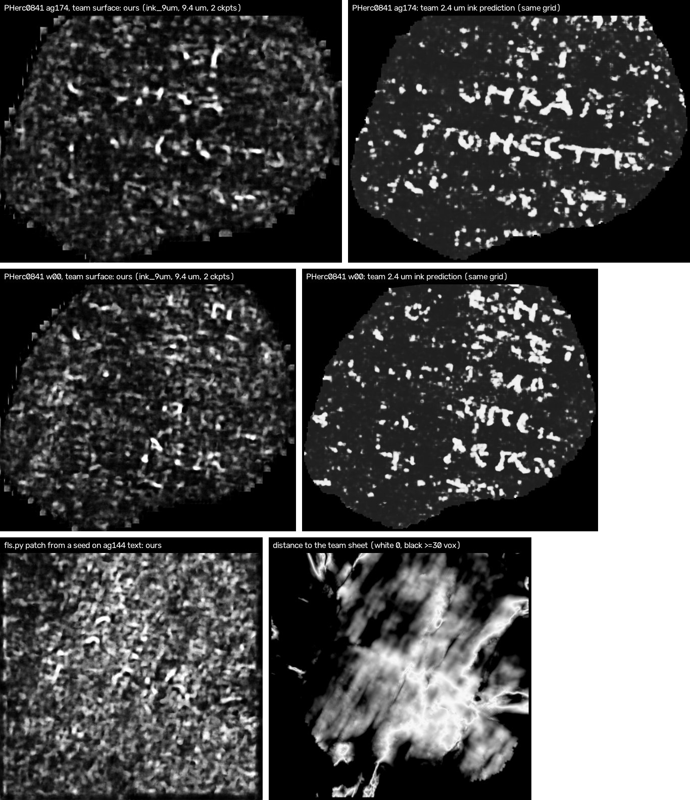

# Calibration: does the survey pipeline show text on a scroll the models never saw?

**In one paragraph.** PHerc0841 is not in the `ink_9um` training set (PHerc0139, PHerc1667, PHerc Paris 4, PHerc0814)
and is not First Letters eligible, and the team's 2.4 µm ink predictions show Greek text on three of its traced
segments. We ran the survey pipeline on its 9.366 µm scan, taken like the eligible 9.362 µm volumes (1.2 m, 113 keV). On the team's traced surfaces, rendered exactly as the survey renders, `ink_9um` finds where the ink is: its
maps correlate with the team's predictions (r 0.54–0.61, shifted-map nulls at most 0.13) and reach a pixel AUC of
0.74–0.81 against the team's labels. At letter scale it is blobs: Chris Scheirer's high-pass score is 0.015–0.027 for
a single released checkpoint and 0.046–0.054 for all 14 averaged, rows show on one of the three segments, and no letter
is readable. When `fls.py` grows its own surface from a seed placed on that text, the surface leaves the text-bearing
sheet (0 of 3 patches stay within 5 voxels of it; median distance 20–28 voxels) and its ink maps look like the
survey's speckle. So a survey negative means that the automatic patch showed no text, not that the spot has none.

## Setup

- **Scan and surfaces.** Volume `20250821151531` (9.366 µm, 113 keV, 1.2 m). The team's three traced segments on it, in
  tifxyz: w00 (`20260220213127-w00`), ag144 (`20260220214732-auto_grown_20260220144552896`) and ag174
  (`20260221022814-auto_grown_20260220174252405`), the names used in [villa #1867](https://github.com/ScrollPrize/villa/issues/1867).
  `PLAN.md` and the scripts call the last two `ag896` and `ag405`.
- **Reference.** The team's ink predictions from the 2.403 µm scan (`ink-detection/*.tif`) and ink labels
  (`ink-labels/2.403um-volume-20260319124803/20260918/`), all from the open-data bucket.
- **Arm A (clean surfaces).** Each team mesh rendered with `fls.py`'s own render step (28 layers, `--flip-normals`,
  scale 1), then `ink_9um` in both directions: A1 with the survey's two checkpoints (seed42/75k, seed43/20k), A2 with
  all 14, a mean map per direction.
- **Arm B (the whole tool, unmodified).** `fls.py run` with 100 generations and the default checkpoints, from a catalog
  row for PHerc0841 (`catalog_PHerc0841.json`). B2: one seed per team segment at its densest text (`informed_seeds.py`,
  team data only). B1: three seeds from the survey's own seed rule.
- **Readouts.** R1 the survey's row score; R2 Pearson r between our map and the team's prediction on the same grid,
  both smoothed at 0.5 mm, against the same r with the team map shifted by 10 and 20 mm in four directions; R3 by eye,
  our maps first and only then the team's; R4 pixel AUC against the labels inside the `supervision` mask.
- **Pre-registration.** `PLAN.md` fixed the arms, readouts and pass/fail criteria before any ink inference on
  PHerc0841 (local commit, 2026-09-24 08:34Z, sha256 `b7f55eabad57da29794313f8865ee5986aad5837b651e7a25c87cca46e772e86`;
  not a public timestamp). Everything added afterwards is marked post-hoc below.

## Verdicts under the pre-registered rules

- **Arm A: inconclusive.** A mean map meets R1 > 28.7 (the survey's highest map when the plan was written; one patch
  finished later scores 33.5) and R2 above its null on 1 of the 3
  segments (ag174: row score 57.8, r 0.602 against a null maximum of 0.099); a pass needed 2 of 3. It is not a fail
  either: R2 is above its null on all three segments. On w00 and ag144 no mean map, 2 or 14 checkpoints, either
  direction, gets above a row score of 15.4.
- **Arm B2: 0 of 3** patches on the team sheet (median distance over the overlap 27.8, 19.9 and 26.9 voxels; the rule
  was at most 5), and 0 of 3 meet the arm A test (best row score 20.9).
- **Arm B1:** reported below; no criterion, since where the text lies at those spots is unknown.
- **A planning miss.** The row-score threshold came from the survey's own maximum and was not checked against the
  reference before the plan was frozen. The team's own prediction scores 34.1 (w00), 28.7 (ag144) and 111.8 (ag174)
  on the same grid, so the threshold was barely reachable on w00 and not reachable on ag144, even for a perfect map.

## Arm A: the team's surfaces

- **Render check.** Our render equals the team's 9.366 µm surface volume of the same mesh: r 0.999998 on all three
  (512 × 512 centre crop, all 28 layers), 99.3–99.4 % of voxels identical, same layer order. Forward is the right
  direction on all three, as #1867's ablation found for the published surface volumes.

| segment | map (forward) | R1 row score | R2 r (null max) | R4 AUC | letter-scale hp r (post-hoc) |
|---|---|---|---|---|---|
| w00 | 2 checkpoints | 13.5 | 0.541 (0.104) | 0.794 | 0.024 |
| w00 | 14 checkpoints | 10.1 | 0.555 (0.126) | 0.813 | 0.046 |
| ag144 | 2 checkpoints | 12.2 | 0.601 (0.126) | 0.743 | 0.029 |
| ag144 | 14 checkpoints | 13.8 | 0.603 (0.121) | 0.756 | 0.053 |
| ag174 | 2 checkpoints | 57.8 | 0.602 (0.099) | 0.757 | 0.027 |
| ag174 | 14 checkpoints | 52.8 | 0.611 (0.112) | 0.761 | 0.054 |

- **Reverse direction.** Mean maps AUC 0.478–0.66, R2 0.092–0.163 (above its null on 3 of 6); forward means AUC
  0.743–0.813, R2 0.541–0.611 (6 of 6).
- **Against #1867.** AndreasHad04's ablation there scores seed42/75k on the team's 9.366 µm surface volumes at 0.7680
  (w00), 0.7599 (ag144) and 0.7614 (ag174), against 0.7740 in distribution. Ours, same checkpoint on identical renders:
  0.748, 0.719 and 0.750, a few hundredths lower. We pool the labels differently (their 9.6 µm level, nearest
  neighbour, full extent onto our grid) and did not look into the difference further.
- **Letter scale (post-hoc, `hp_score_posthoc.py`).** Chris Scheirer's score from
  [vesuvius-reports, report 02](https://github.com/ShribyrLabs/vesuvius-reports/tree/main/02-9um-ink-reader-benchmark),
  with his constants: remove a 48 µm blur from both maps and correlate what is left. The key is the team's 2.403 µm
  prediction area-averaged onto our grid (median tile offset at most 0.07 px). The survey's two checkpoints score
  0.015–0.027 alone (all 14 single checkpoints 0.015–0.030, next point), the reverse means 0.000–0.007, the
  shifted-key nulls at most 0.007. On his scale (his exams, not these): the released model 0.035, blobs 0.04, a read where a person made out four letters 0.076, the best current reads
  0.11–0.14. Averaging the 14 released checkpoints about doubles a single checkpoint's score here and still stays at
  blob level; part of that gain is smoothing (next point).
- **Blur-matched (post-hoc, 2026-09-27, [`blur_matched/`](blur_matched/)).** Blurring a map raises this score, so
  numbers compare only at the same blur. That is Chris Scheirer's caveat in report 02 (which also finds that averaging
  raises the score on its known-bad exam, where every read is blobs, roughly in proportion to w042's), and he raised
  it about these numbers in our #robots thread. Every map blurred by the same Gaussian (inside the mesh), the key left
  as is, one pixel set per segment (`blur_matched.py`, `blur_matched.json`):

  | segment | blur σ (px) | 14 single checkpoints, min–median–max | 14-checkpoint mean | mean ÷ best single | mean ÷ median single |
  |---|---|---|---|---|---|
  | w00 | 0 | 0.016–0.020–0.026 | 0.046 | 1.78 | 2.33 |
  | w00 | 2 | 0.025–0.029–0.039 | 0.061 | 1.58 | 2.09 |
  | w00 | 4 | 0.034–0.039–0.052 | 0.072 | 1.39 | 1.83 |
  | ag144 | 0 | 0.016–0.024–0.030 | 0.053 | 1.77 | 2.23 |
  | ag144 | 2 | 0.026–0.034–0.045 | 0.070 | 1.58 | 2.07 |
  | ag144 | 4 | 0.039–0.046–0.056 | 0.082 | 1.47 | 1.80 |
  | ag174 | 0 | 0.015–0.025–0.030 | 0.054 | 1.78 | 2.18 |
  | ag174 | 2 | 0.025–0.036–0.045 | 0.072 | 1.59 | 1.98 |
  | ag174 | 4 | 0.036–0.046–0.057 | 0.083 | 1.46 | 1.80 |

  Blurred alike, the 14-checkpoint mean still scores above every single checkpoint, by less: 1.39–1.47 times the best
  one at 4 px, against 1.77–1.78 unblurred. Whether that remainder is letter signal would take a known-bad exam like
  his, which we do not have here. Blur alone lifts the mean from 0.046–0.054 to 0.072–0.083 at 4 px, around
  the 0.076 of his four-letter read, and by eye no letter becomes readable in the 700 px window of each segment where
  the team's prediction has the most 48 µm high-pass energy (`blur_view_*.jpg`: the mean as is, the mean blurred
  4 px, the best single checkpoint blurred 4 px, the team's prediction). Shifted-key nulls (both survey checkpoints
  and both means, up to 4 px): below 0.011.
- **By eye (`r3_notes.md`).** w00 and ag144: speckle with a few blurry letter-like shapes, which turn out to sit on the
  team's strongest letters; no rows. ag174: letter-like strokes along two or three lines, which turn out to be the
  team's two clearest rows, letter by letter; the survey's visual check would have flagged this map. Nothing readable
  on any of the three.

## Arm B: the whole tool

| patch | area cm² | R1 forward / reverse mean | median distance to the team sheet (vox) | share within 5 vox | R2 on the part within 5 vox (px at 2 vox) |
|---|---|---|---|---|---|
| B2, seed on w00 | 14.30 | 15.7 / 9.4 | 27.8 | 2.8 % | 0.605, null 0.209 (109,460) |
| B2, seed on ag144 | 14.38 | 11.9 / 20.9 | 19.9 | 8.5 % | 0.562, null −0.088* (335,195) |
| B2, seed on ag174 | 14.29 | 9.3 / 7.8 | 26.9 | 4.8 % | 0.100, null 0.389 (184,747) |
| B1, seed 9 (z 0.5, r 0.7) | 15.53 | 10.2 / 17.7 | | | |
| B1, seed 0 (z 0.3, r 0.5) | 17.08 | 11.3 / 6.7 | | | |
| B1, seed 6 (z 0.5, r 0.5) | 13.89 | 13.1 / 11.3 | | | |

\* On small, scattered parts most of the 10–20 mm shifts leave fewer than 1000 overlapping pixels, so these nulls rest
on few shifts.

- **The tracer leaves the sheet as it grows.** For the patch seeded on ag144, the median distance to the team's sheet
  is 5.6 voxels within 100 voxels of the seed, then 7.6, 11.7, 15.2 and 29.7 voxels at 1000–2000 voxels. The ag174
  seed was snapped 7.73 voxels from the team's mesh point and probably started on a neighbouring sheet.
- **Where a patch does lie on the team's sheet** (0.4 and 1.2 cm² for the w00 and ag144 seeds), our map agrees with
  the team's there (r 0.605 and 0.562).
- **By eye.** All six maps look like the survey's speckle: 10–25 % of pixels above 0.5 in the B2 forward means,
  against 5–9 % in arm A's; swirl-like arcs on B1 seed 9, a hole-rim artifact on B1 seed 6; nothing letter-like, not
  even on the patch seeded on ag174's text.
- All six `fls.py` runs finished with exit code 0 (3146–4590 s each, 13.89–17.08 cm² per patch), so the tool runs
  unmodified on a scroll outside its built-in catalog, given a catalog row.

## What it means

- **For the survey:** its negatives say that the automatic patches showed no text. Two reasons, both measured here on
  a scroll with known text: the tracer leaves the text-bearing sheet, and even on a correct surface the 9 µm maps of an
  unseen scroll are faint. This agrees with Chris Scheirer's reports on PHerc0826 and on 9 µm readers
  ([01](https://github.com/ShribyrLabs/vesuvius-reports/tree/main/01-pherc0826-first-letters-null),
  [02](https://github.com/ShribyrLabs/vesuvius-reports/tree/main/02-9um-ink-reader-benchmark)), which reach the same
  conclusion by other routes.
- **For anyone searching the eligible scrolls with `ink_9um`:** a surface that stays on the sheet matters as much as
  the reader, and checking a patch's distance to a known sheet is cheap when one exists (`score_b.py`).

## Deviations and notes

- Arm B ran two jobs at a time, the B2 jobs first; `PLAN.md` fixes neither.
- The A2 notes by eye are not blind: the team's maps had been seen during A1.
- The letter-scale score, the team-map row scores, the figure and the display scripts (`r3_views.py`, `r3_b_views.py`,
  `team_rowscore.py`, `make_results_tables.py`, `hp_score_posthoc.py`, `make_figure.py`) were added after the runs, and
  the blur-matched rescoring (`blur_matched/`) on 2026-09-27. No pre-registered readout was changed.
- The scripts are the copies that ran; their paths are from our machine.

## Files

`PLAN.md` (frozen), `r3_notes.md` (notes by eye, in the order written), `results_tables.md` (every map, generated from
the JSON files by `make_results_tables.py`), `armA_results.json`, `armB_results.json`, `team_rowscore.json`,
`hp_score_posthoc.json`, `seeds_informed.json`, `seeds_blind.txt`, `catalog_PHerc0841.json`, `logs/`, `scripts/`,
`blur_matched/` (scripts, JSON, log and views of the blur-matched rescoring), `depth_sharpen/`.

## Credits and data

The pixel-AUC comparison on these three segments is AndreasHad04's (villa #1867), with liliandevarieux's observations
on depth order in the same thread; ibara pointed out that the `validation` mask of these label sets lies mostly outside
`supervision` ([ink-disagree](https://github.com/ibarapascal/ink-disagree); we score inside `supervision`). The letter-scale score and its script are Chris Scheirer's (MIT), and so is the blur-matched comparison. Scan,
meshes, ink predictions and labels: Vesuvius Challenge open data (CC BY-NC 4.0), and the figure derived from them
carries those terms.
